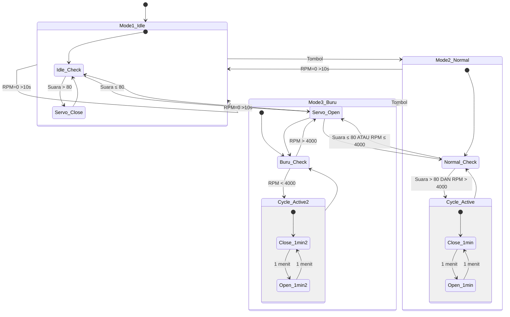
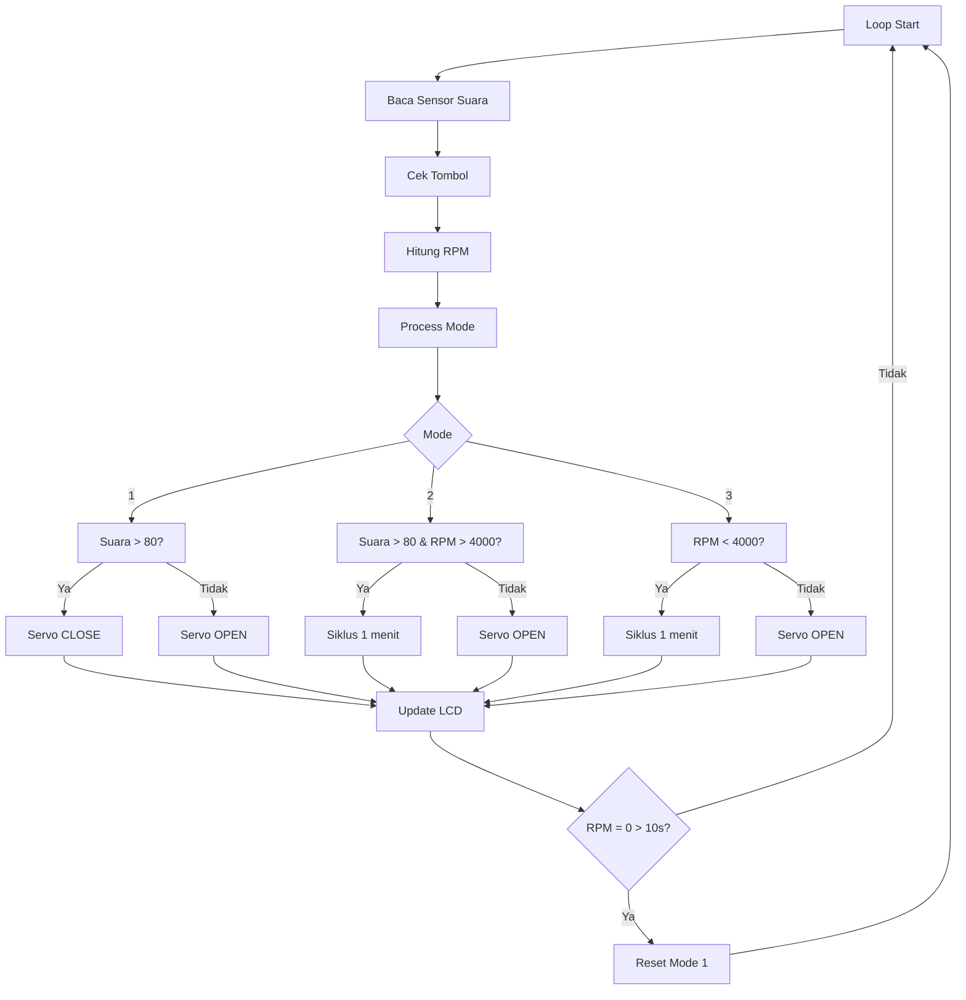

# Sistem Kontrol Katup Servo SG90 - Arduino Uno R3


Sistem kontrol katup otomatis menggunakan **Servo SG90** dengan 3 mode operasi berbasis sensor suara (KY-037) dan RPM (IR Speed Sensor).

---

## 📋 Spesifikasi Hardware

| Komponen               | Pin Arduino | Keterangan                 |
|-----------------------|------------|----------------------------|
| Servo SG90            | D9 (PWM)   | Kontrol sudut katup        |
| LCD I2C 16x2          | SDA, SCL   | Alamat 0x27                |
| IR Speed Sensor       | D2         | Interrupt untuk hitung RPM |
| Sound Detector KY-037 | A0         | Input analog suara         |
| Push Button           | D3         | Mode switch (pull-up)      |

---

## 🔌 Wiring Diagram


( Tambahkan wiring diagram di sini jika diperlukan )


---

## 🔄 Diagram State Machine



📊 Flowchart Program


📈 Diagram Timing

```mermaid
gantt
    title Siklus Servo 1 Menit
    dateFormat X

    section Close
    Servo Close :a1, 0, 60

    section Open
    Servo Open :a2, 60, 60

    section Loop
    Repeat :a3, 120, 60

```



🖥️ Tampilan LCD
```
┌──────────────────┐
│ M:1 RPM:4000     │
│ S:85% V:CLOSE    │
└──────────────────┘

```

🔧 Mode Operasi

🟢 Mode 1 - Idle
```
Kondisi| Aksi Servo
Suara > 80| CLOSE
Suara ≤ 80| OPEN

```

🟡 Mode 2 - Normal
```
Kondisi| Aksi
Suara > 80 & RPM > 4000| Siklus 1 menit
Tidak terpenuhi| OPEN
```

🔴 Mode 3 - Buru
```
Kondisi| Aksi
RPM < 4000| Siklus
RPM ≥ 4000| OPEN

```

⚡ Auto Reset
```
- RPM = 0 selama 10 detik → kembali ke Mode 1

```

🚀 Upload (PlatformIO)
```
pio run
pio run --target upload
pio device monitor

```

📁 Struktur Project
```
servo-katup-kontrol/
├── platformio.ini
├── README.md
├── src/
│   └── main.cpp

```

📜 Lisensi

Open Source

---

Versi: 1.0.0
Board: Arduino Uno R3
